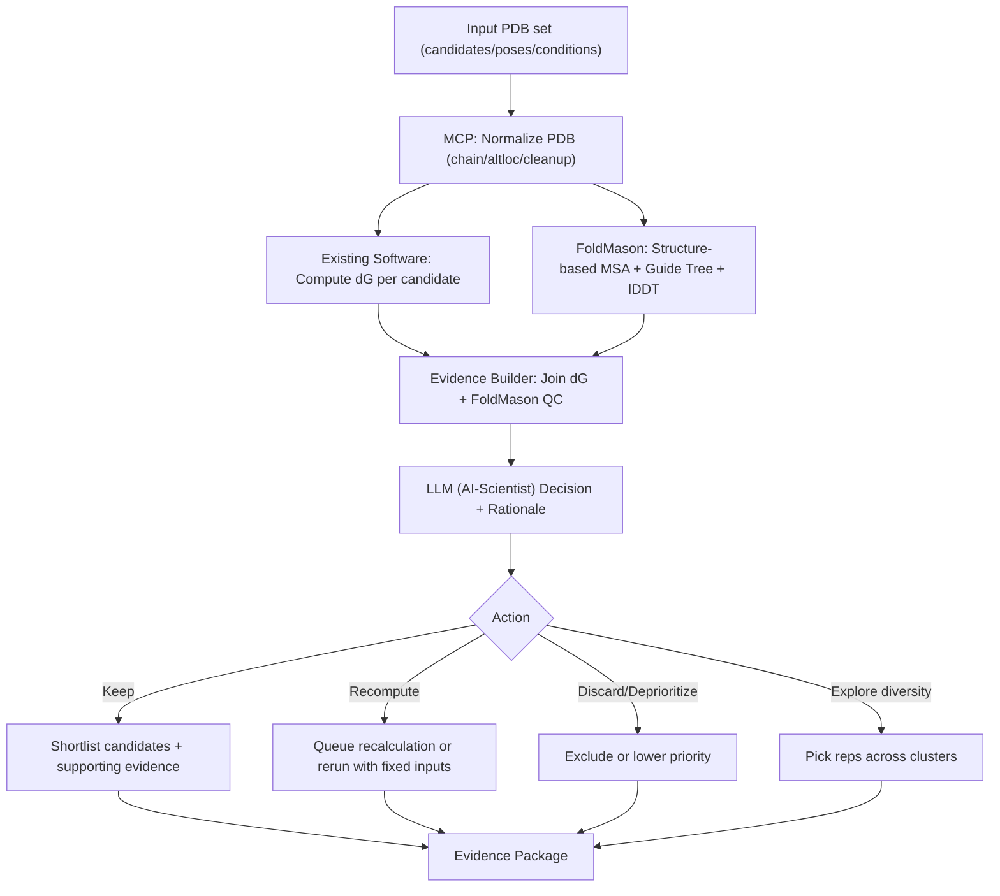

# PRST_N_FM

**PyRosetta + FoldMason + BioNeMo** 기반 단백질 구조 분석 & Drug Discovery 파이프라인

AlphaFold3 예측 구조를 FoldMason으로 정렬/평가하고, NVIDIA NIM API(MolMIM, DiffDock, RFdiffusion, ProteinMPNN, ESMFold)로 가상 스크리닝을 수행하는 워크플로우.

---

## 환경 설치

### 요구사항

- Ubuntu 22.04 / WSL2
- Miniconda 또는 Anaconda
- NVIDIA API 키 (`nvapi-` 접두사, [build.nvidia.com](https://build.nvidia.com)에서 발급) -- GPU 불필요

### 빠른 시작

```bash
# 1. 레포 클론
git clone https://github.com/MD-Agent/PRST_N_FM.git
cd PRST_N_FM

# 2. Conda 환경 생성 (PyRosetta + FoldMason + PyMOL 포함)
conda env create -f environment-bio-tools.yml

# 3. 활성화
conda activate bio-tools

# 4. 환경 검증
python scripts/verify_bio_tools_env.py

# 5. BioNeMo API 의존성 (선택)
pip install -r bionemo/requirements.txt

# 6. API 키 설정
echo "nvapi-YOUR_KEY" > molmim.key
```

또는 원클릭 스크립트:

```bash
bash scripts/setup_ubuntu2204.sh
```

### 포함 도구

#### 로컬 도구 (Conda `bio-tools`)

| 도구 | 버전 | 용도 |
|------|------|------|
| PyRosetta | 2026.06 | 분자 모델링 (scoring, relax, docking) |
| FoldMason | 4.dd3c235 | 구조 기반 다중 정렬 + lDDT 평가 |
| PyMOL | 3.1.0 (OSS) | 분자 시각화 |
| Biopython | 1.86 | 구조 파일 파싱/변환 |
| RDKit | 2025.03.6 | 화학 정보학 |
| Meeko | 0.7.1 | AutoDock-GPU 전처리 |

#### NVIDIA NIM API (GPU 불필요, 클라우드 추론)

| 모델 | 용도 | 클라이언트 |
|------|------|-----------|
| MolMIM | 소분자 생성/QED 최적화 | `bionemo/molmim_client.py` |
| DiffDock | Blind molecular docking | `bionemo/diffdock_client.py` |
| RFdiffusion | De novo 펩타이드 바인더 설계 | `bionemo/rfdiffusion_client.py` |
| ProteinMPNN | 역접힘 (backbone → sequence) | `bionemo/proteinmpnn_client.py` |
| ESMFold | 서열 → 구조 예측 | `bionemo/esmfold_client.py` |

---

## SSTR2 Virtual Screening Pipeline

SSTR2(Somatostatin Receptor Type 2)에 대해 기존 리간드(Somatostatin-14)보다 더 강하게 결합하는 분자를 3가지 경로로 병렬 탐색:

```
                      AlphaFold3 복합체
                     (SSTR2 + Somatostatin)
                            |
                  바인딩 포켓 분석 (35잔기)
                     /      |       \
             Arm 1         Arm 2         Arm 3
           소분자        펩타이드       De Novo
          MolMIM        변이체       RFdiffusion
             |             |             |
         DiffDock      FlexPepDock   ProteinMPNN
           도킹           도킹           |
             |             |         ESMFold
              \            |         /
                통합 랭킹 & 비교
```

### 주요 결과

| Arm | 방법 | 후보 수 | 주요 지표 | 상태 |
|-----|------|---------|----------|------|
| 1 | 소분자 (MolMIM + DiffDock) | 40 (15 도킹) | QED=0.94, confidence=-3.0 | 완료 |
| 2 | 펩타이드 변이체 | 13 | Ala scan + 강화 변이체 | 분석 완료 |
| 3 | De Novo (RFdiff + MPNN + ESMFold) | 16 | pLDDT=81.4 (최고) | 완료 |

> 상세 보고서: [experiments/00_FULL_REPORT.md](experiments/00_FULL_REPORT.md)

---

## 실험 기록

| # | 실험 | 설명 | 문서 |
|---|------|------|------|
| 00 | **전체 보고서** | **전체 실험 종합 보고서** | [experiments/00_FULL_REPORT.md](experiments/00_FULL_REPORT.md) |
| 01 | CIF -> PDB 변환 | AlphaFold3 mmCIF 13개 -> PDB 변환 | [experiments/01_cif_to_pdb.md](experiments/01_cif_to_pdb.md) |
| 02 | FoldMason MSA | 3개 모델 구조 정렬, lDDT 0.664 | [experiments/02_foldmason_msa.md](experiments/02_foldmason_msa.md) |
| 03 | PyMOL 시각화 | PDB 로드/시각화 테스트 (WSL) | [experiments/03_pymol_visualization.md](experiments/03_pymol_visualization.md) |
| 04 | PyRosetta 환경구축 | 설치/동작 확인, 향후 계획 | [experiments/04_pyrosetta_setup.md](experiments/04_pyrosetta_setup.md) |
| 05 | SSTR2 Virtual Screening | 3-Arm 가상 스크리닝 파이프라인 | [experiments/05_sstr2_virtual_screening.md](experiments/05_sstr2_virtual_screening.md) |

---

## 파이프라인 개요

### 구조 분석 파이프라인



SVG 버전: [docs/pipeline_orchestration.svg](docs/pipeline_orchestration.svg)

---

## 디렉토리 구조

```
PRST_N_FM/
├── README.md                       # 이 파일
├── environment-bio-tools.yml       # conda 환경 정의
├── pipeline_orchestration.mermaid  # 파이프라인 다이어그램 소스
├── molmim.key / ngc.key            # API 키 (.gitignore)
│
├── bionemo/                        # NVIDIA NIM API 클라이언트 & 파이프라인
│   ├── README.md                  # BioNeMo 모듈 상세 문서
│   ├── api_base.py                # 공통 API 베이스 클래스
│   ├── molmim_client.py           # MolMIM 클라이언트
│   ├── diffdock_client.py         # DiffDock 클라이언트
│   ├── rfdiffusion_client.py      # RFdiffusion 클라이언트
│   ├── proteinmpnn_client.py      # ProteinMPNN 클라이언트
│   ├── esmfold_client.py          # ESMFold 클라이언트
│   ├── 01_embedding_similarity.py # MolMIM 시나리오 1
│   ├── 02_molecule_generation.py  # MolMIM 시나리오 2
│   ├── 03_property_optimization.py# MolMIM 시나리오 3
│   ├── 04_sstr2_pocket_analysis.py# Step 0: 바인딩 포켓 분석
│   ├── 05_sstr2_smallmol_screen.py# Arm 1: 소분자 스크리닝
│   ├── 06_sstr2_flexpep_dock.py   # Arm 2: 펩타이드 변이체
│   └── 07_sstr2_denovo_binder.py  # Arm 3: De Novo 바인더
│
├── data/
│   └── fold_test1/                 # AlphaFold3 예측 결과
│       ├── *_model_{0-4}.cif/pdb   # 5개 모델
│       ├── *_full_data_{0-4}.json  # 전체 예측 데이터
│       ├── *_summary_confidences_*.json
│       ├── msas/                   # MSA (paired/unpaired)
│       └── templates/              # 템플릿 구조
│
├── results/
│   ├── foldmason/                  # FoldMason 결과
│   │   ├── result_foldmason.html   # 대화형 MSA 뷰어
│   │   ├── result_foldmason_aa.fa  # AA 기반 MSA
│   │   ├── result_foldmason_3di.fa # 3Di 기반 MSA
│   │   └── result_foldmason.nw     # 가이드 트리
│   └── sstr2_docking/              # SSTR2 도킹 결과
│       ├── binding_pocket.json     # 바인딩 포켓 잔기
│       ├── sstr2_receptor.pdb      # SSTR2 단독 PDB
│       ├── arm1_smallmol/          # DiffDock 도킹 결과
│       ├── arm2_flexpep/           # 변이체 분석
│       └── arm3_denovo/            # RFdiffusion + ESMFold
│
├── experiments/                    # 실험 기록
│   ├── 00_FULL_REPORT.md          # 전체 종합 보고서
│   ├── 01_cif_to_pdb.md
│   ├── 02_foldmason_msa.md
│   ├── 03_pymol_visualization.md
│   ├── 04_pyrosetta_setup.md
│   └── 05_sstr2_virtual_screening.md
│
├── scripts/                        # 유틸리티 & 실행 스크립트
│   └── (23개 스크립트 -- 아래 표 참고)
│
└── docs/                           # 참조 문서
    ├── FOLDMASON_REFERENCE.md
    ├── PYMOL_REFERENCE.md
    ├── ENV_COMPATIBILITY.md
    ├── PDB_VISUALIZATION_TOOLS.md
    └── pipeline_orchestration.svg
```

---

## 스크립트 목록

### 환경 & 유틸리티

| 스크립트 | 설명 |
|---------|------|
| `scripts/setup_ubuntu2204.sh` | Ubuntu 22.04/WSL2 원클릭 환경 설치 (Conda + bio-tools) |
| `scripts/verify_bio_tools_env.py` | Conda 환경 정상 동작 검증 (Biopython, PyRosetta 등) |
| `scripts/cif_to_pdb.py` | mmCIF -> PDB 일괄 변환 (Biopython) |
| `scripts/compile_mermaid.sh` | Mermaid 다이어그램 -> SVG/PNG 컴파일 |
| `scripts/run_pymol_pdb.sh` | PyMOL로 PDB 시각화 실행 래퍼 |
| `scripts/build_autodock_gpu.sh` | AutoDock-GPU 소스 빌드 (CUDA/OpenCL) |

### BioNeMo API 테스트

| 스크립트 | 설명 |
|---------|------|
| `scripts/test_molmim.sh` | MolMIM 클라이언트 동작 테스트 |
| `scripts/test_molmim_curl.sh` | MolMIM API curl 직접 호출 테스트 |
| `scripts/test_diffdock.sh` | DiffDock 클라이언트 동작 테스트 |
| `scripts/test_esmfold.sh` | ESMFold 클라이언트 동작 테스트 |

### SSTR2 파이프라인 실행

| 스크립트 | 설명 |
|---------|------|
| `scripts/run_sstr2_pipeline.sh` | **전체 파이프라인 일괄 실행** (Step 0 + Arm 1~3) |
| `scripts/run_pocket_analysis.sh` | Step 0: 바인딩 포켓 분석 단독 실행 |
| `scripts/run_arm1.sh` | Arm 1: 소분자 스크리닝 실행 |
| `scripts/run_arm2.sh` | Arm 2: 펩타이드 변이체 분석 실행 |
| `scripts/run_arm3.sh` | Arm 3: De Novo 바인더 설계 실행 |
| `scripts/run_arm3_step2.sh` | Arm 3 Step 2: ProteinMPNN 단독 재실행 |
| `scripts/run_arm3_step2_v2.sh` | Arm 3 Step 2: ProteinMPNN + ESMFold 재실행 (수정 버전) |
| `scripts/run_arm3_esmfold.sh` | Arm 3 Step 3: ESMFold 단독 재실행 |
| `scripts/run_scenarios.sh` | MolMIM 시나리오 스크립트(01~03) 일괄 실행 |

### Git 관리

| 스크립트 | 설명 |
|---------|------|
| `scripts/git_status.sh` | Git 상태 + 리모트 정보 확인 |
| `scripts/push_bionemo.sh` | BioNeMo 관련 파일 pull + push |
| `scripts/push_pipeline.sh` | 파이프라인 결과 stage + commit + push |
| `scripts/sync_and_push.sh` | Stash → pull --rebase → pop → push (충돌 방지) |

---

## 참고 문서

- [전체 실험 보고서](experiments/00_FULL_REPORT.md)
- [BioNeMo 모듈 가이드](bionemo/README.md)
- [FoldMason 완전 가이드](docs/FOLDMASON_REFERENCE.md)
- [PyMOL 완전 가이드](docs/PYMOL_REFERENCE.md)
- [환경 호환성 분석](docs/ENV_COMPATIBILITY.md)
- [PDB 시각화 도구 비교](docs/PDB_VISUALIZATION_TOOLS.md)

---

## 라이선스

- **PyRosetta**: 학술 라이선스 필요 ([RosettaCommons](https://www.rosettacommons.org/software/license-and-download))
- **FoldMason**: GPL-3.0 ([steineggerlab/foldmason](https://github.com/steineggerlab/foldmason))
- **PyMOL Open-Source**: BSD-like
- **NVIDIA NIM API**: [NVIDIA API TOS](https://www.nvidia.com/en-us/data-center/products/nvidia-ai-enterprise/eula/)
