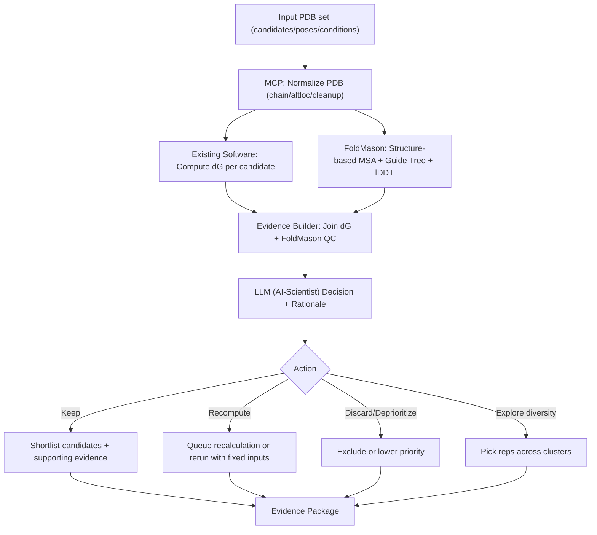

# PRST_N_FM

**PyRosetta + FoldMason** 기반 단백질 구조 분석 파이프라인

AlphaFold3 예측 구조를 FoldMason으로 정렬/평가하고, PyRosetta로 에너지 분석, PyMOL로 시각화하는 워크플로우.

---

## 환경 설치

### 요구사항

- Ubuntu 22.04 / WSL2
- Miniconda 또는 Anaconda

### 빠른 시작

```bash
# 1. 레포 클론
git clone https://github.com/MD-Agent/PRST_N_FM.git
cd PRST_N_FM

# 2. Conda 환경 생성 (PyRosetta + FoldMason + PyMOL 포함)
conda env create -f environment-bio-tools.yml

# 3. 활성화
conda activate bio-tools

# 4. 환경 검증
python scripts/verify_bio_tools_env.py
```

또는 원클릭 스크립트:

```bash
bash scripts/setup_ubuntu2204.sh
```

### 포함 도구

| 도구 | 버전 | 용도 |
|------|------|------|
| PyRosetta | 2026.06 | 분자 모델링 (scoring, relax, docking) |
| FoldMason | 4.dd3c235 | 구조 기반 다중 정렬 + lDDT 평가 |
| PyMOL | 3.1.0 (OSS) | 분자 시각화 |
| Biopython | 1.86 | 구조 파일 파싱/변환 |
| RDKit | 2025.03.6 | 화학 정보학 |
| Meeko | 0.7.1 | AutoDock-GPU 전처리 |

---

## 실험 기록

| # | 실험 | 설명 | 문서 |
|---|------|------|------|
| 01 | CIF -> PDB 변환 | AlphaFold3 mmCIF 13개 -> PDB 변환 | [experiments/01_cif_to_pdb.md](experiments/01_cif_to_pdb.md) |
| 02 | FoldMason MSA | 3개 모델 구조 정렬, lDDT 0.664 | [experiments/02_foldmason_msa.md](experiments/02_foldmason_msa.md) |
| 03 | PyMOL 시각화 | PDB 로드/시각화 테스트 (WSL) | [experiments/03_pymol_visualization.md](experiments/03_pymol_visualization.md) |
| 04 | PyRosetta 환경구축 | 설치/동작 확인, 향후 계획 | [experiments/04_pyrosetta_setup.md](experiments/04_pyrosetta_setup.md) |

---

## 파이프라인 개요



SVG 버전: [docs/pipeline_orchestration.svg](docs/pipeline_orchestration.svg)

---

## 디렉토리 구조

```
PRST_N_FM/
├── README.md                       # 이 파일
├── environment-bio-tools.yml       # conda 환경 정의
├── pipeline_orchestration.mermaid  # 파이프라인 다이어그램 소스
│
├── data/
│   └── fold_test1/                 # AlphaFold3 예측 결과
│       ├── *_model_{0-4}.cif/pdb   # 5개 모델
│       ├── *_full_data_{0-4}.json  # 전체 예측 데이터
│       ├── *_summary_confidences_*.json
│       ├── msas/                   # MSA (paired/unpaired)
│       └── templates/              # 템플릿 구조
│
├── results/
│   └── foldmason/                  # FoldMason 결과
│       ├── result_foldmason.html   # 대화형 MSA 뷰어
│       ├── result_foldmason_aa.fa  # AA 기반 MSA
│       ├── result_foldmason_3di.fa # 3Di 기반 MSA
│       └── result_foldmason.nw     # 가이드 트리
│
├── experiments/                    # 실험 기록
│   ├── 01_cif_to_pdb.md
│   ├── 02_foldmason_msa.md
│   ├── 03_pymol_visualization.md
│   └── 04_pyrosetta_setup.md
│
├── scripts/                        # 유틸리티 스크립트
│   ├── cif_to_pdb.py              # CIF->PDB 변환
│   ├── setup_ubuntu2204.sh        # 환경 원클릭 설치
│   ├── run_pymol_pdb.sh           # PyMOL 실행 래퍼
│   ├── compile_mermaid.sh         # Mermaid->SVG
│   └── verify_bio_tools_env.py    # 환경 검증
│
└── docs/                           # 참조 문서
    ├── FOLDMASON_REFERENCE.md     # FoldMason 완전 가이드
    ├── PYMOL_REFERENCE.md         # PyMOL 완전 가이드
    ├── ENV_COMPATIBILITY.md       # 환경 호환성
    ├── PDB_VISUALIZATION_TOOLS.md # 시각화 도구 비교
    └── pipeline_orchestration.svg # 파이프라인 SVG
```

---

## 참고 문서

- [FoldMason 완전 가이드](docs/FOLDMASON_REFERENCE.md)
- [PyMOL 완전 가이드](docs/PYMOL_REFERENCE.md)
- [환경 호환성 분석](docs/ENV_COMPATIBILITY.md)
- [PDB 시각화 도구 비교](docs/PDB_VISUALIZATION_TOOLS.md)

---

## 라이선스

- **PyRosetta**: 학술 라이선스 필요 ([RosettaCommons](https://www.rosettacommons.org/software/license-and-download))
- **FoldMason**: GPL-3.0 ([steineggerlab/foldmason](https://github.com/steineggerlab/foldmason))
- **PyMOL Open-Source**: BSD-like
