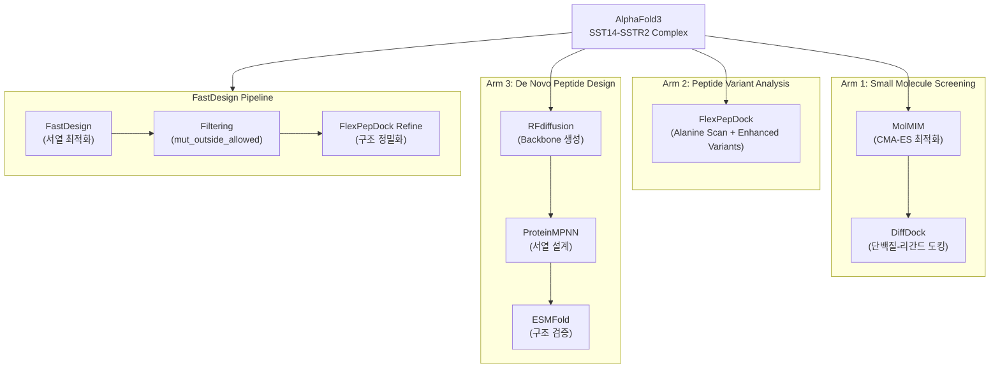
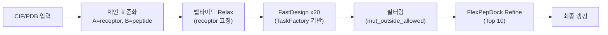
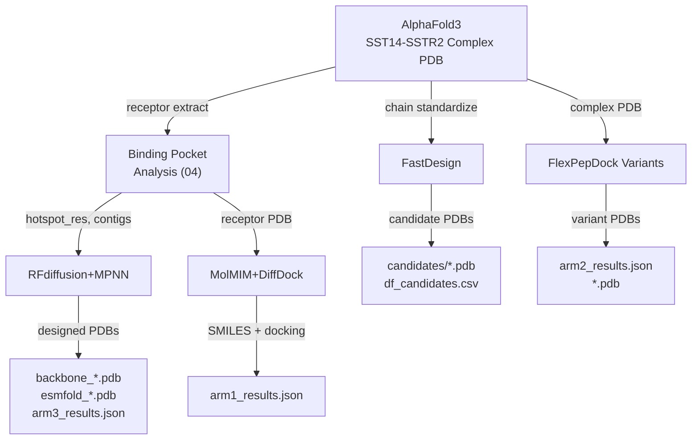

# SSTR2 타겟 후보 생성 파이프라인 비교 분석

> 이 문서는 SSTR2(Somatostatin Receptor Type 2) 타겟에 대한 4가지 후보 생성 파이프라인을
> 비교 분석한다. 각 파이프라인의 설계 철학, 입출력, 스코어링, 실행 환경을 정리하여
> 연구자가 목적에 맞는 파이프라인을 선택할 수 있도록 한다.

---

## 1. 개요

본 레포지토리에는 SSTR2 타겟에 대해 4가지 독립적인 후보 생성 접근법이 구현되어 있다.

| # | 파이프라인 | 대상 | 접근법 | 구현 위치 |
|---|-----------|------|--------|----------|
| 1 | **FastDesign** | 펩타이드 서열 최적화 | 물리 기반 (Rosetta) | [notebooks/SSTR2_SST14_demo.ipynb](../notebooks/SSTR2_SST14_demo.ipynb) |
| 2 | **RFdiffusion + ProteinMPNN** | De novo 펩타이드 설계 | ML 기반 (Diffusion + Inverse Folding) | [bionemo/07_sstr2_denovo_binder.py](../bionemo/07_sstr2_denovo_binder.py) |
| 3 | **MolMIM + DiffDock** | 소분자 스크리닝 | ML 기반 (생성 + 도킹) | [bionemo/05_sstr2_smallmol_screen.py](../bionemo/05_sstr2_smallmol_screen.py) |
| 4 | **FlexPepDock 변이체 분석** | 펩타이드 변이체 평가 | 물리 기반 (Rosetta) | [bionemo/06_sstr2_flexpep_dock.py](../bionemo/06_sstr2_flexpep_dock.py) |

### 파이프라인 관계도



---

## 2. 파이프라인별 상세 분석

### 2.1 FastDesign (Rosetta 기반 펩타이드 서열 최적화)

**목적**: 기존 SST14 펩타이드의 특정 위치를 Rosetta FastDesign으로 최적화하여 결합 친화도가
향상된 변이체를 생성한다.

**구현 위치**: `notebooks/SSTR2_SST14_demo.ipynb` (Cell 26-35)

#### 입력

| 항목 | 값 |
|------|-----|
| 입력 구조 | `standardized_relaxed.pdb` (Chain A = receptor, Chain B = peptide) |
| 설계 위치 | `design_pos="2,3,6,7,8,10"` (펩타이드 내 6개 위치) |
| 후보 수 | `n=20` |
| 전처리 | CIF → PDB 변환 → 체인 표준화 → 펩타이드 Relax |

#### 파이프라인 단계



1. **TaskFactory 구성**: 리셉터 전체 + 펩타이드 Cys 잔기 고정, 나머지 위치 설계 가능
2. **FastDesign 실행**: `n=20`개 후보 생성, 각각 독립적으로 실행
3. **변이 검출**: `diff_positions()`로 원래 서열 대비 변이 위치 탐지
4. **정책 위반 필터링**: 허용 위치 밖의 변이(`mut_outside_allowed`) 보유 후보 제거
5. **FlexPepDock Refine**: 상위 10개 후보를 FlexPepDock으로 정밀화

#### 출력 형식

**DataFrame: `df_candidates`**

| 컬럼 | 타입 | 설명 |
|------|------|------|
| `candidate` | str | 파일명 (예: `candidate_001.pdb`) |
| `pdb_path` | str | PDB 파일 경로 |
| `seq` | str | 펩타이드 서열 |
| `dG_REU` | float | 결합 에너지 (REU, 낮을수록 강한 결합) |
| `dSASA` | float | 인터페이스 Solvent Accessible Surface Area 변화 (A^2) |
| `mut_positions` | list[int] | 변이 위치 목록 |
| `mut_outside_allowed` | list[int] | 허용 범위 밖 변이 위치 |
| `design_time_s` | float | 설계 소요 시간 (초) |
| `cleavage_risk` | float | 절단 위험도 |
| `hydrophobic_fraction` | float | 소수성 잔기 비율 |
| `net_charge_proxy` | float | 순전하 추정 (양전하 - 음전하) |
| `pk_penalty` | float | 약동학 페널티 |
| `rank_score` | float | 종합 랭킹 점수 |

**파일 출력**:
- PDB: `candidates/candidate_{001-020}.pdb`
- 캐시: `candidates/df_candidates.csv` + `candidates/meta.json`
- Refined: `refined/refined_{001-010}.pdb`

#### 스코어링

```
rank_score = (-dG_REU) - 0.5 * cleavage_risk - 1.0 * pk_penalty
```

| 항목 | 산출 방식 |
|------|----------|
| `dG_REU` | `InterfaceAnalyzerMover` → `get_interface_dG()` |
| `dSASA` | `InterfaceAnalyzerMover` → `get_interface_delta_sasa()` |
| `cleavage_risk` | `2.0 * (K+R count) + 1.0 * (F+Y+W count)` |
| `pk_penalty` | `5.0 * max(0, hydrophobic_fraction - 0.50) + 0.5 * abs(net_charge_proxy)` |

#### 실행 환경

- **로컬 실행**: PyRosetta 필수
- **예상 소요 시간**: 후보당 3-10분, 전체 20개 약 1-3시간
- **캐시 지원**: `LOAD_FROM_CACHE = True`로 CSV에서 재로드 가능

---

### 2.2 RFdiffusion + ProteinMPNN (De Novo 펩타이드 설계)

**목적**: 기존 펩타이드 서열에 의존하지 않고, SSTR2 결합 포켓에 맞는 완전히 새로운
펩타이드 바인더를 생성한다.

**구현 위치**: `bionemo/07_sstr2_denovo_binder.py`

#### 입력

| 항목 | 값 |
|------|-----|
| 리셉터 구조 | `results/sstr2_docking/sstr2_receptor.pdb` |
| 결합 포켓 정보 | `results/sstr2_docking/binding_pocket.json` |
| Contigs | `"B1-369/0 10-30"` (리셉터 보존 + 10-30 잔기 신규 펩타이드) |
| Hotspot 잔기 | Binding pocket JSON에서 Top 10 |

#### 파이프라인 단계


1. **RFdiffusion**: `NUM_DESIGNS=5`개 backbone 구조 생성 (diffusion_steps=50)
2. **ProteinMPNN**: 각 backbone에 대해 `SEQS_PER_BACKBONE=4`개 서열 설계 (sampling_temp=0.2)
3. **ESMFold 검증**: 설계된 서열의 구조 예측 및 pLDDT 평가
4. **필터링**: `PLDDT_THRESHOLD=50` 이상만 통과

#### 출력 형식

**JSON: `arm3_results_{timestamp}.json`**

```json
{
  "pipeline": "Arm 3: De Novo Peptide Binder Design",
  "receptor_pdb": "...",
  "hotspot_res": ["B122", "B127"],
  "contigs": "B1-369/0 10-30",
  "num_backbone_designs": 5,
  "num_sequences_per_backbone": 4,
  "plddt_threshold": 50,
  "total_backbones": 4,
  "total_sequences": 16,
  "verified_designs": 12,
  "designs": [
    {
      "backbone_idx": 0,
      "seq_idx": 0,
      "sequence": "MKIT...",
      "plddt": 81.4
    }
  ]
}
```

**파일 출력**:
- Backbone PDB: `backbone_{00-04}.pdb`
- ESMFold PDB: `esmfold_bb{XX}_seq{Y}.pdb`
- 결과 JSON: `arm3_results_{timestamp}.json`

#### 스코어링

| 지표 | 설명 | 기준 |
|------|------|------|
| `pLDDT` | predicted Local Distance Difference Test (0-100) | >= 50 통과 |

pLDDT는 ESMFold의 구조 예측 신뢰도로, 설계된 서열이 안정적으로 접힐 수 있는지를 평가한다.
결합 친화도 자체를 직접 평가하지는 않으며, 추가 도킹/MD 시뮬레이션이 필요하다.

#### 실행 환경

- **API 기반**: NVIDIA NIM API (RFdiffusion, ProteinMPNN, ESMFold)
- **API Endpoint**: `https://health.api.nvidia.com/v1/biology/...`
- **예상 소요 시간**: 전체 파이프라인 5-15분 (API 응답 시간 의존)
- **캐시 지원**: 없음 (결과 JSON 수동 관리)

---

### 2.3 MolMIM + DiffDock (소분자 스크리닝)

**목적**: 기존 SSTR2 결합 소분자(Paltusotine, Octreotide 등)를 시드로 하여
QED가 높은 신규 소분자 후보를 생성하고, DiffDock으로 도킹 평가한다.

**구현 위치**: `bionemo/05_sstr2_smallmol_screen.py`

#### 입력

| 항목 | 값 |
|------|-----|
| 리셉터 구조 | `results/sstr2_docking/sstr2_receptor.pdb` |
| 시드 분자 | Paltusotine, L054522, Pasireotide, Octreotide (SMILES) |
| 생성 파라미터 | `num_molecules=10`, `algorithm="CMA-ES"`, `property_name="QED"` |
| 최소 유사도 | `min_similarity=0.3` |

#### 파이프라인 단계


1. **MolMIM 생성**: 4개 시드 x 10개 분자 = 최대 40개 후보 (CMA-ES 최적화, QED 최대화)
2. **QED 랭킹**: 전체 후보를 QED 점수로 정렬, 상위 15개 선택
3. **DiffDock 도킹**: 선택된 15개 후보를 리셉터에 도킹 (num_poses=5)
4. **결과 저장**: JSON에 도킹 결과 포함

#### 출력 형식

**JSON: `arm1_results_{timestamp}.json`**

```json
{
  "pipeline": "Arm 1: Small Molecule Screening",
  "receptor": "...",
  "seeds": {"Paltusotine": "SMILES...", ...},
  "total_candidates": 40,
  "docked_candidates": 15,
  "results": [
    {
      "seed_name": "Paltusotine",
      "seed_smiles": "...",
      "smiles": "...",
      "qed_score": 0.85,
      "docking": {"confidence": 0.92, "poses": [...]},
      "docking_status": "success"
    }
  ]
}
```

**파일 출력**: JSON만 (PDB 파일 별도 미저장)

#### 스코어링

| 지표 | 설명 | 기준 |
|------|------|------|
| `QED` | Quantitative Estimate of Drug-likeness (0-1) | 높을수록 좋음 |
| `DiffDock confidence` | 도킹 포즈 신뢰도 | 높을수록 좋음 |
| `similarity` | 시드 대비 구조 유사도 | >= 0.3 (min_similarity) |

#### 실행 환경

- **API 기반**: NVIDIA NIM API (MolMIM, DiffDock)
- **예상 소요 시간**: 전체 파이프라인 5-10분
- **캐시 지원**: 없음 (결과 JSON 수동 관리)

---

### 2.4 FlexPepDock 변이체 분석

**목적**: SST14 야생형(AGCKNFFWKTFTSC)의 Alanine scanning 및 enhanced 변이체를
FlexPepDock으로 평가하여 각 잔기의 결합 기여도를 파악한다.

**구현 위치**: `bionemo/06_sstr2_flexpep_dock.py`

#### 입력

| 항목 | 값 |
|------|-----|
| 복합체 구조 | `data/fold_test1/fold_test1_model_0.pdb` (AlphaFold3 예측) |
| 야생형 서열 | `AGCKNFFWKTFTSC` (14 잔기) |
| 변이체 수 | 11개 (Alanine scan 6개 + Enhanced 5개) |

#### 변이체 목록

| 이름 | 서열 | 변이 유형 |
|------|------|----------|
| wildtype | AGCKNFFWKTFTSC | 기준 |
| F6A | AGCKN**A**FWKTFTSC | Alanine scan |
| F7A | AGCKNF**A**WKTFTSC | Alanine scan |
| W8A | AGCKNFF**A**KTFTSC | Alanine scan |
| K9A | AGCKNFFW**A**TFTSC | Alanine scan |
| T10A | AGCKNFFWK**A**FTSC | Alanine scan |
| F11A | AGCKNFFWKT**A**TSC | Alanine scan |
| octreotide_linear | FCFWKTCT | 약물 유사체 |
| enhanced_1 | **S**GCKNFFWKTFTSC | A1S (극성 증가) |
| enhanced_2 | AGC**R**NFFWKTFTSC | K4R (양전하 강화) |
| enhanced_3 | AGCKN**Y**FWKTFTSC | F6Y (수소결합 추가) |
| enhanced_4 | AGCKNFFW**R**TFTSC | K9R (양전하 강화) |
| enhanced_5 | AGCKNFFWKT**Y**TSC | F11Y (수소결합 추가) |

#### 파이프라인 단계


1. **복합체 로드**: AlphaFold3 예측 구조 로드 및 기준 에너지 계산
2. **변이 도입**: 각 변이체의 아미노산 치환 (`MutateResidue`)
3. **FlexPepDock**: 변이 구조의 도킹 정밀화
4. **비교 분석**: 야생형 대비 에너지 변화(delta_energy) 계산

**현재 상태**: PyRosetta 미설치 시 서열 분석만 수행 (`HAS_PYROSETTA = False`)

#### 출력 형식

**JSON: `arm2_results_{timestamp}.json`**

```json
{
  "pipeline": "Arm 2: Peptide Variant FlexPepDock",
  "complex_pdb": "...",
  "wildtype": "AGCKNFFWKTFTSC",
  "pyrosetta_available": false,
  "num_variants": 11,
  "results": [
    {
      "name": "F7A",
      "sequence": "AGCKNFAWKTFTSC",
      "length": 14,
      "mutations": ["F7A"],
      "status": "analysis_only",
      "total_energy": null,
      "delta_energy": null
    }
  ]
}
```

**파일 출력**: 개별 PDB `{variant_name}.pdb` (PyRosetta 사용 시)

#### 스코어링

| 지표 | 설명 | 기준 |
|------|------|------|
| `total_energy` | Rosetta 전체 에너지 (REU) | 낮을수록 안정 |
| `delta_energy` | 야생형 대비 에너지 변화 | 음수 = 개선, 양수 = 약화 |

#### 실행 환경

- **로컬 실행**: PyRosetta 필수 (없으면 서열 분석만)
- **예상 소요 시간**: 변이체당 5-15분, 전체 약 1-3시간
- **캐시 지원**: 없음 (결과 JSON 수동 관리)

---

## 3. 비교 매트릭스

### 3.1 핵심 비교

| 비교 항목 | FastDesign | RFdiffusion+MPNN | MolMIM+DiffDock | FlexPepDock 변이체 |
|-----------|-----------|------------------|-----------------|-------------------|
| **설계 대상** | 펩타이드 (서열 최적화) | 펩타이드 (de novo) | 소분자 | 펩타이드 (변이체 평가) |
| **접근법** | 물리 기반 | ML 기반 | ML 기반 | 물리 기반 |
| **실행 환경** | 로컬 (PyRosetta) | API (NVIDIA NIM) | API (NVIDIA NIM) | 로컬 (PyRosetta) |
| **후보 수** | 20개 | 20개 (5 x 4) | 40개 (4 x 10) | 11개 (고정) |
| **최종 선별** | rank_score 기반 | pLDDT >= 50 | QED Top 15 | delta_energy |
| **구조 출력** | PDB | PDB | 없음 (SMILES) | PDB |
| **결과 포맷** | DataFrame + CSV | JSON | JSON | JSON |
| **캐시 지원** | CSV + meta.json | 없음 | 없음 | 없음 |
| **소요 시간** | 1-3시간 | 5-15분 | 5-10분 | 1-3시간 |
| **GPU 필요** | 아니오 | 아니오 (API) | 아니오 (API) | 아니오 |
| **API Key 필요** | 아니오 | 예 (NVIDIA) | 예 (NVIDIA) | 아니오 |

### 3.2 스코어링 방식 비교

| 파이프라인 | 주요 지표 | 방식 | 물리적 의미 |
|-----------|----------|------|------------|
| **FastDesign** | `rank_score` | `-dG - 0.5*cleavage - 1.0*pk_penalty` | 결합 에너지 + 약물성 |
| **RFdiffusion+MPNN** | `pLDDT` | ESMFold 구조 예측 신뢰도 | 접힘 안정성 (결합은 미평가) |
| **MolMIM+DiffDock** | `QED` + `confidence` | 약물 유사성 + 도킹 신뢰도 | 약물성 + 결합 포즈 |
| **FlexPepDock** | `delta_energy` | 야생형 대비 에너지 차이 | 변이 효과 크기 |

### 3.3 입출력 의존성



---

## 4. 스코어링 상세 비교

### 4.1 FastDesign rank_score

```python
rank_score = (-dG_REU) - 0.5 * cleavage_risk - 1.0 * pk_penalty
```

**구성 요소**:

- `dG_REU`: Rosetta `InterfaceAnalyzerMover`가 산출하는 인터페이스 결합 자유에너지.
  - 음수일수록 강한 결합 → `-dG_REU`가 클수록 좋음
- `cleavage_risk = 2.0 * (K+R) + 1.0 * (F+Y+W)`:
  - Lysine/Arginine은 trypsin-like protease의 절단 부위
  - 방향족 잔기(Phe, Tyr, Trp)는 chymotrypsin-like protease 기질
- `pk_penalty = 5.0 * max(0, hydrophobic_frac - 0.50) + 0.5 * |net_charge|`:
  - 소수성 비율 50% 초과 시 용해도 저하 우려
  - 순전하 편향은 비특이적 결합 위험

**해석**: 결합력 + 약동학 안정성의 multi-objective 최적화. 높을수록 좋다.

### 4.2 RFdiffusion+MPNN pLDDT

```
pLDDT >= 50 (threshold)
```

- ESMFold이 예측한 구조의 per-residue 신뢰도 평균
- **0-50**: 구조적으로 불안정 (disordered)
- **50-70**: 어느 정도 구조 형성
- **70-90**: 신뢰할 수 있는 구조
- **90-100**: 매우 높은 신뢰도

**한계**: pLDDT는 서열 자체의 접힘 가능성만 평가하며, SSTR2와의 결합 친화도는 별도 평가 필요.

### 4.3 MolMIM QED + DiffDock confidence

```
1차: QED score (높은 순) → Top 15 선별
2차: DiffDock confidence (도킹 포즈 품질)
```

- **QED** (Quantitative Estimate of Drug-likeness): MW, LogP, HBD, HBA, PSA, ROTB, AROM, ALERTS의
  가중 기하 평균. 0-1 범위, 높을수록 약물 유사성 높음.
- **DiffDock confidence**: 도킹 포즈의 신뢰도. 리셉터-리간드 상호작용 품질 반영.

### 4.4 FlexPepDock delta_energy

```
delta_energy = variant_total_energy - wildtype_total_energy
```

- Rosetta `ScoreFunction`의 전체 에너지 비교
- **음수**: 야생형보다 안정 → 유리한 변이
- **양수**: 야생형보다 불안정 → 불리한 변이
- **Alanine scan**: 특정 잔기가 결합에 기여하는 정도 정량화

---

## 5. 데이터 흐름 및 상호 운용성

### 5.1 포맷 호환성

| From \ To | FastDesign | RFdiffusion+MPNN | MolMIM+DiffDock | FlexPepDock |
|-----------|-----------|------------------|-----------------|-------------|
| **FastDesign** | - | 호환 불가 (다른 설계 철학) | 해당 없음 (소분자 vs 펩타이드) | PDB 직접 입력 가능 |
| **RFdiffusion+MPNN** | ESMFold PDB → FastDesign 입력 가능 (체인 재표준화 필요) | - | 해당 없음 | ESMFold PDB → FlexPepDock 입력 가능 |
| **MolMIM+DiffDock** | 해당 없음 | 해당 없음 | - | 해당 없음 |
| **FlexPepDock** | enhanced 변이체 서열 → FastDesign 시드 가능 | 해당 없음 | 해당 없음 | - |

### 5.2 잠재적 통합 시나리오

1. **RFdiffusion → FastDesign**: De novo backbone에 FastDesign을 적용하여 서열 추가 최적화
2. **FastDesign → FlexPepDock 변이체**: 최적 후보의 추가 변이체 탐색
3. **FlexPepDock 변이체 → FastDesign**: Enhanced 변이체를 시드로 FastDesign 재실행
4. **공통 출력 통합**: 모든 파이프라인의 최종 후보 PDB를 단일 비교 테이블로 병합

### 5.3 현재 공유 리소스

| 리소스 | 공유 파이프라인 |
|--------|--------------|
| AlphaFold3 complex PDB | FastDesign, FlexPepDock Variants |
| `sstr2_receptor.pdb` | RFdiffusion+MPNN, MolMIM+DiffDock |
| `binding_pocket.json` | RFdiffusion+MPNN, MolMIM+DiffDock |
| NVIDIA NIM API Key | RFdiffusion+MPNN, MolMIM+DiffDock |
| PyRosetta | FastDesign, FlexPepDock Variants |

---

## 6. 권장 사항

### 6.1 사용 시나리오별 추천

| 시나리오 | 추천 파이프라인 | 이유 |
|----------|--------------|------|
| **기존 펩타이드 소폭 개량** | FastDesign | 특정 위치만 설계, 물리적 에너지 직접 최적화 |
| **완전히 새로운 펩타이드 탐색** | RFdiffusion+MPNN | 서열 공간 넓게 탐색, 빠른 실행 |
| **소분자 약물 후보 탐색** | MolMIM+DiffDock | 유일한 소분자 파이프라인 |
| **특정 잔기의 기능 이해** | FlexPepDock 변이체 | Alanine scan으로 잔기별 기여도 파악 |
| **빠른 프로토타이핑** | RFdiffusion+MPNN 또는 MolMIM | API 기반으로 환경 설정 최소화 |
| **정밀한 에너지 평가** | FastDesign + FlexPepDock | Rosetta 에너지 함수 기반 물리적 평가 |

### 6.2 결과 통합을 위한 제안

1. **공통 비교 지표 도입**: 모든 펩타이드 파이프라인(FastDesign, RFdiffusion, FlexPepDock)의
   최종 후보에 대해 동일한 `InterfaceAnalyzerMover` 기반 `dG_REU`/`dSASA` 스코어링 적용
2. **통합 DataFrame**: 출처(pipeline), 서열, dG, pLDDT를 포함하는 단일 비교 테이블 생성
3. **캐시 표준화**: RFdiffusion+MPNN, FlexPepDock 변이체에도 CSV 캐시 적용 (FastDesign 패턴 확장)
4. **상호 검증**: FastDesign 최적 후보를 ESMFold로 pLDDT 검증, RFdiffusion 후보를 FlexPepDock으로 dG 검증

---

## 부록: API 클라이언트 요약

모든 NVIDIA NIM 클라이언트는 `bionemo/api_base.py`의 `NVIDIABaseClient`를 상속한다.

| 클라이언트 | 파일 | Base URL | 주요 메서드 |
|-----------|------|----------|------------|
| `MolMIMClient` | `molmim_client.py` | `.../nvidia/molmim` | `generate()`, `embedding()`, `sampling()` |
| `DiffDockClient` | `diffdock_client.py` | `.../mit/diffdock` | `dock()`, `dock_smiles()`, `dock_multiple_smiles()` |
| `RFdiffusionClient` | `rfdiffusion_client.py` | `.../ipd/rfdiffusion` | `generate()`, `design_binder()`, `design_multiple()` |
| `ProteinMPNNClient` | `proteinmpnn_client.py` | `.../ipd/proteinmpnn` | `predict()`, `predict_from_file()`, `parse_fasta()` |
| `ESMFoldClient` | `esmfold_client.py` | `.../nvidia/esmfold` | `predict()`, `predict_and_save()`, `batch_predict()` |

**API Key 로드 우선순위**:
1. 환경 변수: `NGC_CLI_API_KEY` 또는 `NVIDIA_API_KEY`
2. `.env` 파일 (`bionemo/.env`)
3. 키 파일: `molmim.key` 또는 `ngc.key`
