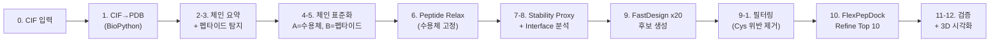
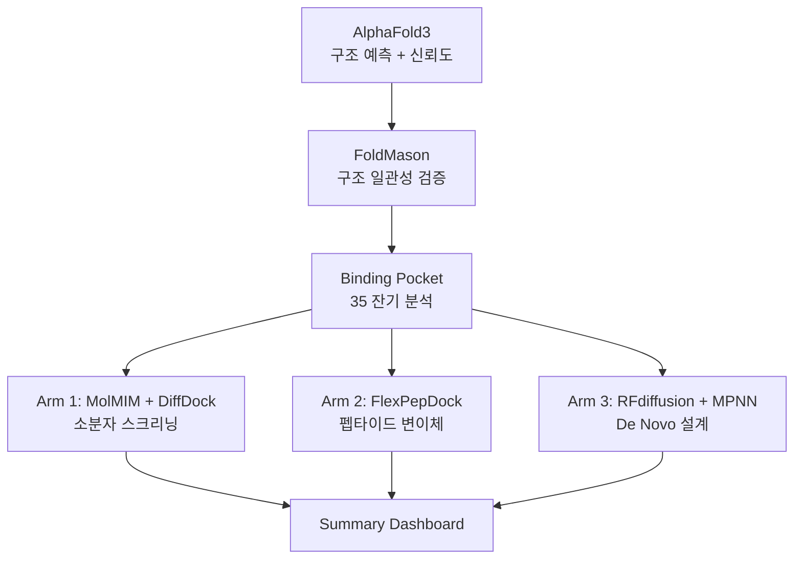
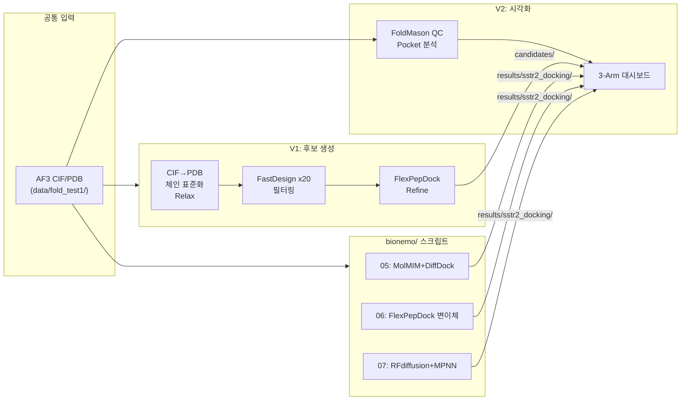

# SSTR2 데모 노트북 버전 비교 분석

> Version 1 (`SSTR2_SST14_demo.ipynb`) vs Version 2 (`presentation_sstr2_pipeline.ipynb`)를
> 구조, 의존성, 파이프라인 흐름, 출력 형식, 사용 시나리오 관점에서 비교한다.

---

## 1. 개요

| 항목 | Version 1 | Version 2 |
|------|-----------|-----------|
| **파일** | [`notebooks/SSTR2_SST14_demo.ipynb`](../notebooks/SSTR2_SST14_demo.ipynb) | [`notebooks/presentation_sstr2_pipeline.ipynb`](../notebooks/presentation_sstr2_pipeline.ipynb) |
| **한 줄 요약** |  CIF 입력에서 후보 PDB까지 직접 생성 |사전 결과를 로드하여 시각화 |
| **핵심 역할** | FastDesign + FlexPepDock 기반 펩타이드 서열 최적화 | 3-Arm 파이프라인 전체 결과 대시보드 |
| **실행 방식** | 셀 순차 실행 → 결과 생성 (30분~1시간 소요) | 사전 결과 JSON/FASTA/PDB 로드 → 시각화 (수초 소요) |

---

## 2. 비교 매트릭스

| 비교 항목 | Version 1 (SSTR2_SST14_demo) | Version 2 (presentation_sstr2_pipeline) |
|-----------|------------------------------|----------------------------------------|
| **목적** | 펩타이드 후보 생성 & 스코어링 | 전체 파이프라인 결과 시각화 & 발표 |
| **핵심 도구** | PyRosetta (FastDesign, FlexPepDock) | FoldMason, MolMIM, DiffDock, RFdiffusion, ProteinMPNN, ESMFold |
| **의존성 (필수)** | PyRosetta, BioPython, pandas, tqdm | numpy, matplotlib |
| **의존성 (선택)** | py3Dmol, PyMOL | py3Dmol, NGC API key |
| **입력 파일** | AlphaFold3 CIF/PDB (`fold_test1_model_0.cif`) | `results/` 내 JSON, FASTA, PDB (사전 생성 결과) |
| **출력물** | PDB 파일, CSV, PyMOL 스냅샷, HTML | matplotlib 그래프, HTML 대시보드, py3Dmol 뷰 |
| **GPU 필요** | 아니오 (CPU PyRosetta) | 아니오 (API 호출 or 결과 로드) |
| **라이선스 필요** | PyRosetta 학술 라이선스 | 없음 (API key만 선택적) |
| **실행 시간** | 30분~1시간+ (FastDesign 20회, FlexPepDock) | 수초 (결과 로드 + 렌더링) |
| **셀 수** | ~35 (코드+마크다운) | ~20 (코드+마크다운) |

---

## 3. Version 1 상세: SSTR2_SST14_demo.ipynb

### 3.1 목적

AlphaFold3 예측 구조를 입력으로 받아, PyRosetta 기반의 물리 시뮬레이션을 **직접 실행**하여
SSTR2에 더 강하게 결합하는 펩타이드 변이체 후보를 생성한다.

### 3.2 파이프라인 단계



### 3.3 단계별 상세

| # | 단계 | 설명 | 출력 |
|---|------|------|------|
| 0 | 실행 전 체크 | PyRosetta 라이선스, 입력 파일 확인 | — |
| 1 | CIF → PDB | BioPython `MMCIFParser`로 변환 | `fold_test1_model_0_from_cif.pdb` |
| 2 | PDB 체인 요약 | ATOM 라인 파싱, 체인별 길이/서열 확인 | DataFrame |
| 3 | 펩타이드 탐지 | 길이 == 14인 체인 자동 탐지 | peptide chain ID |
| 4 | 체인 표준화 | A=수용체(369aa), B=펩타이드(14aa)로 강제 저장 | `standardized_raw.pdb` |
| 5 | 표준화 검증 | PASS/FAIL 자동 체크 + 3D 뷰 | — |
| 6 | Peptide Relax | FastRelax (수용체 고정, 펩타이드만) | `standardized_relaxed.pdb` |
| 7 | Stability/PK Proxy | cleavage_risk, pk_penalty, hydrophobic_fraction | proxy 점수 |
| 8 | Interface 분석 | InterfaceAnalyzerMover → dG, dSASA | 에너지 값 |
| 9 | FastDesign | 20개 후보 생성 (TaskFactory 기반) | `candidates/candidate_*.pdb`, CSV |
| 9-1 | 필터링 | Cys 이황화결합 위반 후보 제거 | `df_candidates_filtered` |
| 10 | FlexPepDock Refine | 상위 후보 정밀화 + 재스코어링 | `refined/` PDB |
| 11 | 표준화 유지 확인 | Relax 후에도 A/B 체인 유지 검증 | — |
| 12 | 정리 | 3D 비교, PyMOL 스냅샷 | PNG, HTML |

### 3.4 주요 함수

| 함수 | 역할 |
|------|------|
| `cif_to_pdb()` | BioPython CIF → PDB 변환 |
| `standardize_to_AB()` | 체인 표준화 (A=수용체, B=펩타이드) |
| `relax_peptide_only()` | 수용체 고정, 펩타이드만 Relax |
| `stability_pk_proxy_scores()` | 안정성/약물동태 proxy 점수 |
| `analyze_interface()` | dG/dSASA (InterfaceAnalyzerMover) |
| `build_task_factory()` | FastDesign용 TaskFactory 구성 |
| `fastdesign_candidates()` | 20개 후보 일괄 생성 |
| `flexpepdock_refine()` | FlexPepDock 정밀화 |
| `render_snapshot()` | PyMOL 자동 스냅샷 |

### 3.5 스코어링 체계

| 메트릭 | 수식 / 설명 | 높/낮 |
|--------|-------------|-------|
| `dG_REU` | 결합 에너지 (Rosetta Energy Unit) | 낮을수록 좋음 |
| `dSASA` | 인터페이스 매몰 표면적 (Ų) | 클수록 넓은 접촉 |
| `cleavage_risk` | `2.0 × (K+R) + 1.0 × (F+Y+W)` | 낮을수록 안정 |
| `pk_penalty` | `5.0 × max(0, hydro_frac − 0.5) + 0.5 × |net_charge|` | 낮을수록 좋음 |
| **`rank_score`** | `(−dG_REU) − 0.5 × cleavage_risk − 1.0 × pk_penalty` | **높을수록 좋음** |

---

## 4. Version 2 상세: presentation_sstr2_pipeline.ipynb

### 4.1 목적

AlphaFold3 + FoldMason + BioNeMo NIM API 결과를 **사전 생성된 데이터에서 로드**하여,
3-Arm 가상 스크리닝 파이프라인 전체를 시각적으로 설명한다. 발표/보고용 노트북.

### 4.2 파이프라인 구조



### 4.3 섹션별 상세

| # | 섹션 | 시각화 내용 | 데이터 소스 |
|---|------|-------------|------------|
| — | What is SSTR2? | 타겟 소개, 3-Arm 다이어그램 | 텍스트 |
| 1 | AlphaFold3 | 3D 구조, Ranking Score / pTM / ipTM 바차트, PAE 히트맵 | `data/fold_test1/fold_test1_summary_confidences_*.json` |
| 2 | FoldMason | MSA lDDT(0.664), 잔기별 보존도, 3Di 보존도, 3-모델 중첩 3D | `results/foldmason/result_foldmason_*.fa`, `.nw` |
| 3 | Binding Pocket | 포켓 3D 뷰, 잔기 유형 파이차트, 접촉 분석 | `results/sstr2_docking/binding_pocket.json` |
| 4 | Arm 1 (소분자) | MolMIM CMA-ES 최적화 곡선 (QED), 파이프라인 흐름 | `bionemo/result_optimization_*.json` |
| 5 | Arm 2 (변이체) | 서열 히트맵 (Ala scan + 강화 변이), 약효단 하이라이팅 | `results/sstr2_docking/arm2_flexpep/arm2_results_*.json` |
| 6 | Arm 3 (De Novo) | 퍼널 차트, pLDDT 분포, Top 8 테이블, 최고 후보 3D | `results/sstr2_docking/arm3_denovo/arm3_final_*.json` |
| 7 | Summary | 통합 대시보드, Arm별 비교, Top 5 서열, Next Steps | 모든 결과 통합 |

### 4.4 BioNeMo NIM API 참조

| API | 역할 | 엔드포인트 |
|-----|------|-----------|
| **MolMIM** | 소분자 생성/최적화 (QED 기반 CMA-ES) | `health.api.nvidia.com/v1/biology/nvidia/molmim/generate` |
| **DiffDock** | 소분자 ↔ 단백질 도킹 | `health.api.nvidia.com/v1/biology/mit/diffdock` |
| **RFdiffusion** | De novo 펩타이드 백본 생성 | `health.api.nvidia.com/v1/biology/ipd/rfdiffusion/generate` |
| **ProteinMPNN** | 백본 → 서열 설계 (Inverse Folding) | `health.api.nvidia.com/v1/biology/ipd/proteinmpnn/predict` |
| **ESMFold** | 서열 → 3D 구조 예측 (폴딩 검증) | `health.api.nvidia.com/v1/biology/nvidia/esmfold` |

> GPU 불필요 — 모든 NIM API는 클라우드 호출로 실행

### 4.5 표시되는 메트릭

| 메트릭 | 설명 | 사용처 |
|--------|------|--------|
| Ranking Score | AF3 모델 선택 (0.83) | 섹션 1 |
| pTM / ipTM | 구조/결합 신뢰도 | 섹션 1 |
| PAE | 잔기 간 거리 오차 (Å) | 섹션 1 |
| lDDT | 구조 정렬 일관성 (0.664) | 섹션 2 |
| Conservation | 잔기 보존도 (0~1) | 섹션 2 |
| QED | 약물 유사도 (0.94 달성) | 섹션 4 |
| pLDDT | 폴딩 신뢰도 (70+ = 고신뢰) | 섹션 6 |

---

## 5. 핵심 공통점과 차이점

### 5.1 공통점

| 항목 | 설명 |
|------|------|
| **타겟** | SSTR2 (Somatostatin Receptor Type 2) |
| **리간드** | Somatostatin-14 (AGCKNFFWKTFTSC) |
| **입력 구조** | AlphaFold3 예측 복합체 (Model 0) |
| **3D 시각화** | py3Dmol 사용 (선택적) |
| **체인 구조** | A = 수용체/리간드, B = 리간드/수용체 (표준화) |

### 5.2 차이점

| 차원 | Version 1 | Version 2 |
|------|-----------|-----------|
| **실행 vs 시각화** | 직접 실행하여 새 결과 생성 | 기존 결과를 로드하여 시각화 |
| **범위** | FastDesign 파이프라인 1개 | 3-Arm 전체 파이프라인 |
| **구조 QC** | 없음 (체인 표준화만) | FoldMason lDDT + 보존도 분석 |
| **소분자 스크리닝** | 없음 | Arm 1 (MolMIM + DiffDock) |
| **De novo 설계** | 없음 | Arm 3 (RFdiffusion + ProteinMPNN + ESMFold) |
| **물리 시뮬레이션** | 있음 (Relax, FastDesign, FlexPepDock) | 없음 (결과만 표시) |
| **후보 생성 수** | 20개 (FastDesign) | 표시만 (40 + 13 + 16) |
| **스코어링 깊이** | dG + dSASA + stability proxy + rank_score | 개별 메트릭 표시 (통합 점수 없음) |
| **재현 가능성** | 높음 (동일 입력 → 동일 파이프라인) | 결과 파일 의존 (재실행 불가) |
| **발표 적합도** | 낮음 (실행 로그가 많음) | 높음 (깔끔한 시각화) |

---

## 6. 사용 시나리오

### Version 1을 사용해야 할 때

- **새로운 후보가 필요할 때**: 실제로 FastDesign/FlexPepDock을 돌려 PDB를 생성해야 하는 경우
- **파라미터 튜닝**: design_pos, 후보 수(n), 필터 조건을 변경하며 반복 실험
- **결과 재현**: 동일 CIF에서 동일 파이프라인을 처음부터 재실행
- **로컬 환경 데모**: PyRosetta 라이선스가 있는 환경에서 물리 기반 설계를 보여줄 때

### Version 2를 사용해야 할 때

- **발표/보고**: 파이프라인 전체 흐름과 결과를 청중에게 설명
- **3-Arm 비교**: 소분자, 변이체, de novo 세 접근법의 결과를 나란히 비교
- **빠른 리뷰**: 기존 결과를 수초 만에 로드하여 확인
- **API 없이 오프라인**: NGC API 키 없어도 사전 결과로 시각화 가능

### 두 노트북을 함께 사용하는 워크플로

```
1. Version 2로 전체 파이프라인 이해 + 구조 QC 확인
2. Version 1로 FastDesign 후보 생성 (핵심 실험)
3. bionemo/ 스크립트로 Arm 2, 3 실행
4. Version 2 대시보드에 통합하여 최종 비교
```

---

## 7. 데이터 흐름 연결



---

## 8. 요약 테이블

| | Version 1 | Version 2 |
|---|-----------|-----------|
| **한마디** | "만드는 노트북" | "보여주는 노트북" |
| **강점** | 물리 기반 후보 생성, 재현성 | 전체 파이프라인 시각화, 발표 적합 |
| **약점** | 범위가 FastDesign에 한정 | 새 결과 생성 불가 |
| **실행 환경** | PyRosetta 필수 | matplotlib만 있으면 가능 |
| **보완 관계** | V2의 구조 QC를 입력으로 활용 가능 | V1의 생성 결과를 대시보드에 통합 |
