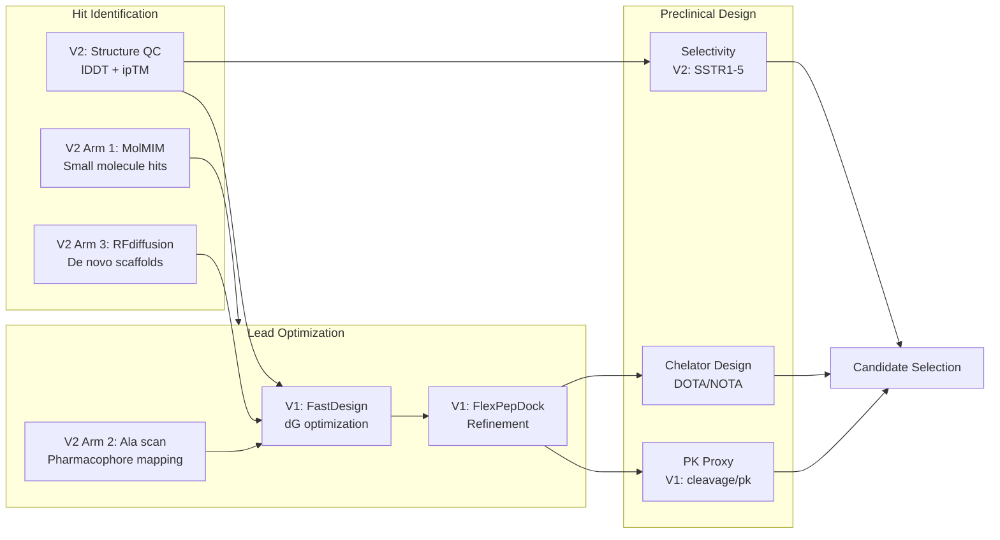

# SSTR2 데모 노트북 과학적 비교분석

### 생명공학 / 의공학 / 방사성의약품 관점

> Version 1 (`SSTR2_SST14_demo.ipynb`) vs Version 2 (`presentation_sstr2_pipeline.ipynb`)를
> SSTR2 타겟의 약물 설계, 약효단 분석, 약물동태, 방사성의약품 적합성 관점에서 비교한다.

---

## 1. SSTR2 타겟 생물학 배경

### 1.1 수용체 개요

**SSTR2 (Somatostatin Receptor Type 2)** 는 Class A G단백질 결합 수용체(GPCR)로,
소마토스타틴(Somatostatin) 펩타이드에 의해 활성화되어 성장호르몬, 인슐린, 글루카곤 분비를 억제한다.

| 항목 | 내용 |
|------|------|
| 수용체 분류 | Class A GPCR, 소마토스타틴 수용체 패밀리 (SSTR1~5) |
| 내인성 리간드 | Somatostatin-14 (SST14, `AGCKNFFWKTFTSC`) |
| 주요 적응증 | 신경내분비종양(NET), 말단비대증(Acromegaly), 쿠싱병 |
| 핵의학 적용 | PRRT (Peptide Receptor Radionuclide Therapy), PET 진단 |

### 1.2 임상에서 사용되는 기존 약물

| 약물 | 유형 | 특징 | 한계 |
|------|------|------|------|
| **Octreotide** | 환형 펩타이드 (주사) | SST14 유도체, 핵심 약효단 보존 | 주사 투여, 짧은 반감기 |
| **Lanreotide** | 환형 펩타이드 (주사) | 장기 작용 제형(Autogel) | 피하주사 필요 |
| **Pasireotide** | 다중-SST 작용제 (주사) | SSTR1/2/3/5 결합 | 범용이나 선택성 부족 |
| **Paltusotine** | 소분자 (경구) | 최초 FDA 승인 경구 SSTR2 작용제 | 최근 승인, 장기 데이터 부족 |

### 1.3 미충족 의료 수요

- **경구 투여 가능한** 펩타이드 또는 소분자
- **더 높은 결합 친화도**: 기존 Octreotide 대비 우수한 dG
- **방사성의약품 호환**: DOTA/NOTA 킬레이터 접합 가능한 펩타이드 scaffold
- **서브타입 선택성**: SSTR2 선택적 vs 범-SSTR 작용제 선택

---

## 2. 약물 설계 전략 비교: 물리 기반 vs AI 기반

### 2.1 V1: 물리 기반 서열 최적화 (Rosetta FastDesign)

V1은 Rosetta 에너지 함수(`ref2015`)를 사용하여 **열역학적 결합 에너지(dG)를 직접 최적화**한다.

| 측면 | 내용 |
|------|------|
| 원리 | 반데르발스, 정전기, 수소결합, 용매화 등 물리적 상호작용 에너지 합 |
| 강점 | 결합 에너지(dG)를 정량적으로 예측, 잔기 수준 에너지 분해 가능 |
| 한계 | 엔트로피 효과 근사적, 탐색 공간이 기존 scaffold에 제한 |
| 생물학적 의미 | 기존 SST14 서열의 "최적화 변이체" 생성 -- Lead Optimization 단계에 적합 |

**파이프라인**:
```
SST14-SSTR2 복합체 → 체인 표준화 → Relax → FastDesign (20 후보) → FlexPepDock Refine
```

### 2.2 V2: AI 기반 다중 접근 (3-Arm Parallel Screening)

V2는 **ML 생성 모델**을 병렬로 활용하여 화학 공간을 넓게 탐색한다.

| Arm | 도구 | 탐색 공간 | 생물학적 전략 |
|-----|------|-----------|--------------|
| Arm 1 | MolMIM + DiffDock | 소분자 | 기존 SSTR2 작용제(Paltusotine, L-054522)에서 출발하여 경구 투여 가능 소분자 생성 |
| Arm 2 | FlexPepDock (Ala scan) | 펩타이드 변이체 | 약효단 잔기별 기여도 정량화, 강화 변이(F→Y, K→R) 설계 |
| Arm 3 | RFdiffusion + ProteinMPNN + ESMFold | De novo 펩타이드 | 기존 리간드 무관하게 새로운 결합 모드(binding mode) 탐색 |

### 2.3 핵심 차이

| 비교 차원 | V1 (FastDesign) | V2 (3-Arm) |
|-----------|-----------------|------------|
| **에너지 정확도** | Rosetta 에너지 직접 계산 (kcal/mol 근사) | ML 신뢰도(pLDDT, QED)로 간접 추정 |
| **화학 공간 범위** | SST14 서열 변이에 제한 | 소분자 + 펩타이드 변이 + de novo scaffold |
| **구조 신뢰도 검증** | InterfaceAnalyzerMover (dG/dSASA) | FoldMason lDDT + ESMFold pLDDT |
| **약물 개발 단계** | Lead Optimization | Hit Identification + Screening |
| **새로운 결합 모드 발견** | 불가 (기존 scaffold 변이) | 가능 (Arm 3 de novo) |

---

## 3. 약효단(Pharmacophore) 분석

### 3.1 SST14 핵심 약효단: Phe7-Trp8-Lys9-Thr10

소마토스타틴의 수용체 인식에 핵심적인 4잔기 약효단(pharmacophore)은
기존 문헌과 V2의 바인딩 포켓 분석에서 일관되게 확인된다.

| 잔기 | 역할 | SSTR2 접촉 잔기 수 | 최소 거리 (Å) | 상호작용 유형 |
|------|------|-------------------|--------------|-------------|
| **Trp8** | 포켓 깊숙이 삽입 | 13 | 2.91 | 소수성 적층(stacking), 포켓 충진 |
| **Lys9** | 최근접 접촉 | 9 | 2.58 | 염다리(salt bridge), Asp122와 정전기 상호작용 |
| **Phe7** | 소수성 접촉 | 8 | 3.11 | 방향족 상호작용 |
| **Thr10** | 보조 결합 | 5 | 3.42 | 수소결합 |

**수용체 측 핵심 잔기**: Asp122 (음전하, Lys9과 salt bridge), Arg184, Trp197, Tyr205, Phe272, Phe294

### 3.2 각 노트북의 약효단 접근법

| 접근법 | V1 | V2 |
|--------|----|----|
| **약효단 보존** | 설계 가능 위치에 포함 (변이 허용) | Alanine scanning으로 중요도 정량화 |
| **약효단 강화** | FastDesign이 자동으로 탐색 | F7→Y (수소결합 추가), K9→R (전하 강화) 명시적 설계 |
| **새로운 약효단** | 불가 (SST14 scaffold 내 변이) | Arm 3에서 완전히 새로운 결합 모드 탐색 |

### 3.3 Cys3-Cys13 이황화결합의 약효학적 의미

SST14의 **Cys3-Cys13 이황화결합**은 환형 구조를 형성하며, 이는:

1. **수용체 결합에 필수**: 환형 토폴로지가 약효단(F7-W8-K9-T10)을 올바른 공간 배치로 고정
2. **프로테아제 저항성**: 환형 구조가 엑소펩티다아제에 의한 분해를 지연
3. **방사성의약품 설계 기반**: Octreotide/DOTATATE도 동일한 환형 모티프 보존

| 노트북 | Cys 처리 |
|--------|---------|
| V1 | Cys3, Cys13 완전 고정 (PreventRepacking) -- 이황화결합 보존 강제 |
| V2 | Arm 2에서 이황화 위치를 변이 제외 영역으로 설정 |

---

## 4. 바인딩 포켓 및 구조 검증

### 4.1 포켓 구조 신뢰도

약물 설계의 전제 조건은 타겟 포켓 구조의 신뢰도이다.

| 검증 방법 | V1 | V2 |
|-----------|----|----|
| **구조 소스** | AF3 Model 0 단일 모델 사용 | AF3 5개 모델 비교 (Ranking Score = 0.83) |
| **모델 간 일관성** | 검증 없음 | FoldMason lDDT = 0.664 (포켓 영역 높은 보존도) |
| **인터페이스 신뢰도** | 체인 표준화 PASS/FAIL 검증 | ipTM = 0.71 (> 0.7 = 신뢰 가능), PAE 히트맵 |
| **포켓 잔기 분석** | 없음 (전체 인터페이스 스코어만) | 35개 잔기, 소수성/극성/전하 비율 분석 |

### 4.2 결합 에너지 측정

| 메트릭 | V1 | V2 | 생물학적 의미 |
|--------|----|----|-------------|
| **dG (REU)** | InterfaceAnalyzerMover 직접 계산 | 계산 안 함 | 결합 자유 에너지 (낮을수록 강한 결합) |
| **dSASA (Ų)** | 직접 계산 (기준값 ~2007 Ų) | 접촉 잔기 수로 간접 추정 | 매몰 표면적 = 결합 면적 |
| **pLDDT** | 해당 없음 | ESMFold 검증 (70+ = 고신뢰) | 설계 서열의 폴딩 가능성 |
| **QED** | 해당 없음 | MolMIM 최적화 (0.94 달성) | 소분자 약물유사성 |

### 4.3 의공학적 시사점

- V1의 **dG 직접 계산**은 결합 친화도의 정량적 비교에 필수적 (IC50/Kd와 상관)
- V2의 **lDDT + ipTM**은 구조 예측의 품질 보증(QA) 역할 -- 잘못된 구조에 기반한 설계를 방지
- 실제 약물 개발에서는 **두 접근법 모두 필요**: QA(V2) → 에너지 최적화(V1)

---

## 5. 약물동태(PK) 및 안정성 관점

### 5.1 V1의 체내 안정성 proxy

V1은 서열 기반 proxy 점수로 펩타이드의 **체내 안정성(혈중 반감기 6~10일 목표)** 을 추정한다.

| Proxy 메트릭 | 수식 | 약학적 의미 |
|-------------|------|------------|
| `cleavage_risk` | `2.0 × (K+R) + 1.0 × (F+Y+W)` | K/R = 트립신 절단 부위, F/Y/W = 키모트립신 절단 부위. 높을수록 체내 프로테아제에 의한 분해 위험 |
| `pk_penalty` | `5.0 × max(0, hydro_frac − 0.5) + 0.5 × |net_charge|` | 과도 소수성 = 응집/낮은 용해도, 과도 전하 = 막 투과 저해. 높을수록 약물동태 불리 |
| `hydrophobic_fraction` | 소수성 잔기(AILMFWVY) 비율 | 0.3~0.5 범위가 이상적; > 0.5이면 응집 위험 |
| `rank_score` | `(-dG) - 0.5×cleavage - 1.0×pk_penalty` | 결합력-안정성-PK의 다목적 최적화 점수 |

### 5.2 V2의 약물성 평가

| 평가 대상 | 메트릭 | 의미 |
|-----------|--------|------|
| 소분자 (Arm 1) | QED (Quantitative Estimate of Drug-likeness) | Lipinski 규칙 등 종합 약물유사성; > 0.9 = drug-like |
| 펩타이드 (Arm 2) | Alanine scan ΔΔG | 각 잔기 치환 시 결합력 변화 → 필수 잔기 식별 |
| De novo (Arm 3) | pLDDT (ESMFold) | 설계 서열의 폴딩 가능성; > 70 = 의도한 구조로 접힘 |

### 5.3 비교 요약

| PK 관점 | V1 | V2 |
|---------|----|----|
| **프로테아제 저항성** | cleavage_risk로 정량화 | 직접 평가 없음 |
| **용해도/응집** | pk_penalty (hydro_fraction) | QED에 LogP 포함 |
| **경구 생체이용률** | 평가 안 함 (펩타이드 한정) | Arm 1이 소분자 경구 투여 지향 |
| **반감기 예측** | proxy 수준 (간이) | 직접 예측 없음 |
| **D-아미노산 도입** | 미지원 | 미지원 (bionemo 워크플로에서 언급) |

---

## 6. 방사성의약품(Radiopharmaceutical) 관점

### 6.1 SSTR2와 방사성의약품

SSTR2는 **PRRT (Peptide Receptor Radionuclide Therapy)** 의 핵심 타겟이다.

| 방사성의약품 | 구성 | 용도 |
|------------|------|------|
| **[177Lu]Lu-DOTATATE** (Lutathera) | DOTA-킬레이터 + Octreotide 유도체 + 177Lu | NET 치료 (FDA 승인) |
| **[68Ga]Ga-DOTATATE** | DOTA + Octreotide 유도체 + 68Ga | PET 진단 (NET 병소 영상) |
| **[90Y]Y-DOTATOC** | DOTA + Octreotide 유도체 + 90Y | 대형 종양 치료 |

방사성의약품 설계에서 펩타이드 리간드의 요구 조건:

1. **높은 수용체 결합력** (낮은 dG) → V1의 직접적 기여
2. **환형 구조 유지** (이황화결합) → 킬레이터 접합 후에도 결합력 보존
3. **킬레이터 접합점** → N/C 말단 또는 비핵심 Lys 측쇄
4. **서브타입 선택성** → SSTR2-only vs pan-SSTR 선택

### 6.2 각 노트북의 방사성의약품 적합성

| 요구 조건 | V1의 기여 | V2의 기여 |
|-----------|----------|----------|
| **결합 친화도** | dG 직접 최적화 (핵심) | pLDDT/QED로 간접 필터링 |
| **환형 구조** | Cys3-Cys13 강제 보존 | Cys 위치 변이 제외 |
| **킬레이터 접합점 식별** | dG 에너지 분해로 비필수 잔기 식별 가능 | Ala scan으로 비핵심 잔기 식별 |
| **서브타입 선택성** | 분석 없음 | FoldMason으로 SSTR1~5 구조 비교 → 선택성 결정 잔기 식별 |
| **새로운 scaffold** | 불가 (SST14 변이만) | Arm 3 de novo → DOTA 접합 가능한 새 scaffold 탐색 |
| **프로테아제 저항성** | cleavage_risk proxy | 미지원 (D-아미노산은 별도 워크플로) |

### 6.3 킬레이터 접합 전략

레포 내 `docs/BIONEMO_REFERENCE.md`에 기술된 SSTR2 방사성의약품 설계 워크플로:

```
Step 1: SSTR2 구조 확보 (AlphaFold3/OpenFold3)
Step 2: 바인딩 포켓 분석
Step 3: 펩타이드 설계 (3-Arm)
Step 4: 복합체 검증 (Boltz-2 / OpenFold3)
Step 5: 킬레이터 부착 위치 선정
        - 에너지 분해로 비결합 잔기 식별
        - N/C 말단 또는 Lys 측쇄 (비핵심 잔기)
Step 6: PyRosetta 고리화 + 안정성 최적화
        - PeptideCyclizeMover (이황화 결합)
        - D-아미노산 도입 (프로테아제 저항성)
Step 7: 최종 후보 선별
```

이 워크플로에서:
- **V1 (FastDesign)** → Step 3 (Arm A: SST14 변이체) + Step 5 (에너지 분해) + Step 6 (고리화)
- **V2 (3-Arm)** → Step 2 (포켓 분석) + Step 3 (전체) + Step 4 (복합체 검증)

### 6.4 Theranostics 확장 가능성

| 전략 | 진단 | 치료 | 필요 데이터 |
|------|------|------|------------|
| SSTR2 선택적 | 68Ga-PET | 177Lu-PRRT | V2의 SSTR 서브타입 비교 |
| 범-SSTR | 68Ga-PET (더 넓은 검출) | 177Lu-PRRT | FoldMason 보존 잔기 |
| 소분자 기반 | 18F-PET 가능 | TBD | V2 Arm 1 결과 |

---

## 7. 임상 번역 가능성 비교

### 7.1 약물 개발 단계 매핑



### 7.2 요약 비교표

| 개발 관점 | V1 (FastDesign) | V2 (3-Arm Pipeline) |
|-----------|-----------------|---------------------|
| **개발 단계** | Lead Optimization | Hit Identification + Screening |
| **타겟 검증** | 단일 모델 사용 | 다중 모델 QC (lDDT, ipTM) |
| **약효단** | 변이 허용 (자동 탐색) | Ala scan으로 체계적 분석 |
| **결합 에너지** | dG 직접 계산 (정량적) | pLDDT/QED (간접적) |
| **화학 다양성** | 낮음 (SST14 변이만) | 높음 (소분자 + de novo) |
| **PK 평가** | cleavage_risk, pk_penalty | QED (소분자), 직접 평가 없음 (펩타이드) |
| **방사성의약품** | 환형 보존, dG 최적화 | 서브타입 선택성, 새 scaffold |
| **경구 투여** | 해당 없음 (펩타이드) | Arm 1 (소분자 지향) |
| **임상 약물과의 거리** | Octreotide 변이체 (가까움) | 새로운 화학 entity (멀지만 혁신적) |

### 7.3 상보적 활용 전략

최적의 SSTR2 약물 발견을 위해 두 노트북은 **순차적으로 결합**되어야 한다:

1. **V2로 타겟 검증 + Hit 발굴**: AF3 구조 QC → 포켓 분석 → 3-Arm에서 다양한 hit 생성
2. **V1으로 Lead 최적화**: V2에서 발굴한 hit 서열을 FastDesign/FlexPepDock으로 에너지 최적화
3. **방사성의약품 확장**: 최적화된 환형 펩타이드에 DOTA 접합 → PRRT/PET 후보

이 워크플로는 기존 Octreotide → DOTATATE 개발 경로를 **계산적으로 재현**하면서,
AI 기반 de novo 설계(Arm 3)로 기존에 발견되지 않은 결합 모드까지 탐색할 수 있다.
